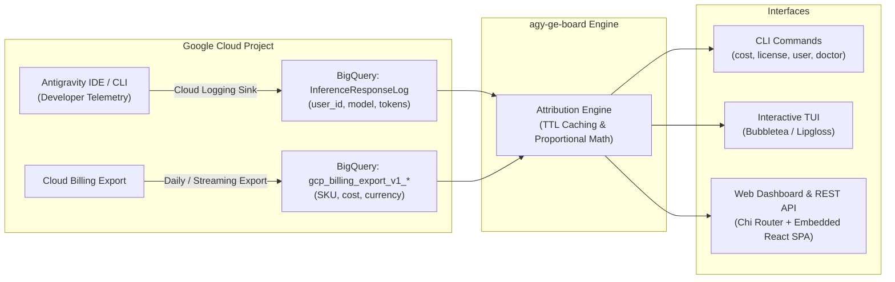

# 📊 AGY & Gemini Enterprise Cost Attribution Board (`agy-ge-board`)

> **Reconcile Antigravity inference telemetry with Google Cloud Billing to attribute per-user AI spend and optimize Gemini Enterprise seat allocations.**

[](https://golang.org)
[](https://react.dev)
[](https://www.docker.com)
[](https://cloud.google.com/run)
[](LICENSE)

Based on the Google Cloud architecture article [**"Per-user cost attribution for Antigravity with BigQuery"**](https://medium.com/google-cloud/per-user-cost-attribution-for-antigravity-with-bigquery-3e98fd997c58), `agy-ge-board` provides FinOps teams, engineering managers, and platform leads with unified cost transparency and license governance for developer AI tooling.

---

## 🌟 Key Features

- **Dual-Mode Single Binary Architecture:**
  - **Full CLI Suite:** Query attribution data with terminal tables, machine-readable JSON, or scriptable CSV.
  - **Interactive Terminal UI (TUI):** Keyboard-driven Bubbletea dashboard featuring real-time FinOps metrics, multi-tab switching, column sorting, and developer drilldown.
  - **Embedded Web Dashboard:** Single binary embeds a compiled React 19 SPA with Tailwind CSS, SVG trend visualizations, search/filter controls, and modal drilldowns.
  - **Cloud Run Native:** Built-in HTTP server listening on dynamic `$PORT`, with `/healthz` liveness probes and graceful shutdown signals (`SIGINT`/`SIGTERM`).
- **Proportional Cost Attribution Engine:**
  - Ingests Antigravity inference telemetry logs (`InferenceResponseLog`) from BigQuery.
  - Matches `labels.user_id`, `labels.model`, and `metadata.totalTokenCount`.
  - Pro-rates Google Cloud Billing export charges (`gcp_billing_export_v1_*`) strictly proportional to each developer's token share by date and model.
  - Thread-safe TTL cache layer prevents duplicate BigQuery scan charges.
- **Gemini Enterprise License Governance:**
  - Tracks configured seat quotas against active developer token consumption across configurable lookback windows (7d, 14d, 30d).
  - Automatically flags **Active**, **At-Risk** (< 1,000 tokens), and **Dormant** (0 tokens) seats.
  - Computes potential monthly reclamation savings ($45/seat/month) to eliminate shelfware.
- **Offline Synthetic Demo Mode:**
  - Built-in `--demo` flag generates 30 days of realistic multi-user/multi-model telemetry and billing records for immediate evaluation without GCP credentials.

---

## 🏗️ Architecture & Telemetry Pipeline



---

## 🚀 Quick Start (Demo Mode)

Run `agy-ge-board` immediately using the embedded demo fixtures without configuring GCP permissions:

```bash
# Clone the repository
git clone https://github.com/julienbreux/agy-ge-board.git
cd agy-ge-board

# Build the single binary
go build -o bin/agy-ge-board ./cmd/agy-ge-board

# 1. Print proportional cost attribution table
./bin/agy-ge-board cost --demo

# 2. Inspect Gemini Enterprise license utilization & dormant savings
./bin/agy-ge-board license --demo

# 3. Drill down into an individual developer's activity
./bin/agy-ge-board user alex.turner@example.com --demo

# 4. Launch the interactive terminal UI (TUI)
./bin/agy-ge-board tui --demo

# 5. Start the web dashboard and open http://localhost:8080
./bin/agy-ge-board serve --demo --port=8080
```

---

## ⚙️ Google Cloud & BigQuery Setup

To connect to live production Google Cloud BigQuery data, follow these configuration steps:

### 1. Create Cloud Logging Sink for Antigravity Inference Logs

Route inference telemetry from Cloud Logging into BigQuery:

```bash
gcloud logging sinks create agy-inference-sink \
  bigquery.googleapis.com/projects/YOUR_PROJECT_ID/datasets/antigravity_telemetry \
  --log-filter='resource.type="cloud_function" OR jsonPayload.log_type="InferenceResponseLog"' \
  --use-partitioned-tables
```

Ensure the sink service account has `roles/bigquery.dataEditor` on the destination dataset.

### 2. Verify Cloud Billing Export to BigQuery

Ensure Standard or Detailed Cloud Billing Export is enabled in your Google Cloud Console:
- Destination Table Format: `YOUR_PROJECT_ID.billing_export.gcp_billing_export_v1_XXXXXX_XXXXXX_XXXXXX`

### 3. Required IAM Permissions

The user or Cloud Run service account running `agy-ge-board` requires:
- `roles/bigquery.jobUser` on the project.
- `roles/bigquery.dataViewer` on the telemetry dataset and billing export dataset.

### 4. Verify Configuration with `doctor`

```bash
agy-ge-board doctor \
  --project=my-gcp-project \
  --telemetry-table=my-gcp-project.antigravity_telemetry.cloud_logging_sink \
  --billing-table=my-gcp-project.billing_export.gcp_billing_export_v1_XXXXXX \
  --seat-quota=25
```

---

## 💻 CLI Command Reference

### `cost`
Computes proportional cost attribution per developer, model, and date.

```bash
agy-ge-board cost [flags]

Flags:
      --days int        Lookback window in days (default 30)
      --model string     Filter by model name (e.g., gemini-1.5-pro, claude-3-5-sonnet)
      --format string    Output format: table (default), json, or csv
```

### `license`
Analyzes Gemini Enterprise seat quotas, active developers, and dormant licenses.

```bash
agy-ge-board license [flags]

Flags:
      --days int        Lookback window in days (default 30)
      --format string    Output format: table (default), json, or csv
```

### `user <email>`
Displays detailed token volume and cost history for an individual engineer.

```bash
agy-ge-board user alex.turner@example.com --days=14 --format=json
```

### `tui`
Launches the full-screen terminal interface.

```bash
agy-ge-board tui [flags]

Controls:
  [Tab] / [1/2/3]   Switch between Costs, Licenses, and User Breakdown tabs
  [s]               Cycle table sorting (Cost, Tokens, Date)
  [Enter]           Open detailed drilldown for selected engineer
  [Esc] / [q]       Close drilldown / Exit dashboard
```

### `serve`
Starts the HTTP server delivering the embedded React SPA and REST API.

```bash
agy-ge-board serve [flags]

Flags:
  -p, --port int        Port to listen on (default 8080, automatically inherits $PORT)
      --host string     Host address to bind to (default "0.0.0.0")
```

---

## 🌐 REST API Endpoints

| Method | Endpoint | Description |
| :--- | :--- | :--- |
| `GET` | `/healthz` | Kubernetes / Cloud Run liveness probe (`{"status":"ok"}`) |
| `GET` | `/api/v1/metrics/overview?days=30` | High-level KPIs, total spend, token count, active users, daily spend trends |
| `GET` | `/api/v1/costs/users?days=30&model=gemini-1.5-pro` | Attributed cost records per developer and model |
| `GET` | `/api/v1/licenses/status?days=30` | Seat quota, active/dormant breakdown, utilization %, estimated monthly savings |
| `GET` | `/api/v1/users/{id}?days=30` | Developer drilldown, total spend, model token distributions |
| `GET` | `/*` | Embedded React SPA static files with client-side routing fallback |

---

## 🐳 Google Cloud Run Deployment

Deploy `agy-ge-board` as a zero-maintenance, autoscaling container on Google Cloud Run:

### 1. Build and Push Container Image

Using Google Cloud Build or local Docker:

```bash
export PROJECT_ID="YOUR_GCP_PROJECT_ID"
export IMAGE="gcr.io/${PROJECT_ID}/agy-ge-board:latest"

# Build container via Google Cloud Build (no local Docker required)
gcloud builds submit --tag ${IMAGE} .
```

### 2. Deploy to Cloud Run

```bash
gcloud run deploy agy-ge-board \
  --image=${IMAGE} \
  --project=${PROJECT_ID} \
  --region=us-central1 \
  --platform=managed \
  --allow-unauthenticated \
  --set-env-vars="PROJECT_ID=${PROJECT_ID},TELEMETRY_TABLE=${PROJECT_ID}.antigravity_telemetry.logs,BILLING_TABLE=${PROJECT_ID}.billing_export.gcp_billing_export_v1_XXXXXX,SEAT_QUOTA=50"
```

Cloud Run will automatically pass the `$PORT` environment variable, which the binary detects on startup.

---

## 🛠️ Local Development & Testing

### Prerequisites
- **Go:** 1.24+
- **Node.js:** 22+ & npm

### Development Workflow

```bash
# 1. Install frontend dependencies and build assets
cd web
npm install
npm run build
cd ..

# 2. Run Go test suite with coverage
go test -v -coverprofile=coverage.out ./...
go tool cover -func=coverage.out

# 3. Run race condition check
go test -v -race ./...

# 4. Run end-to-end integration tests
go test -v ./tests/...
```

---

## 📄 License

This project is licensed under the Apache License 2.0 - see the [LICENSE](LICENSE) file for details.
