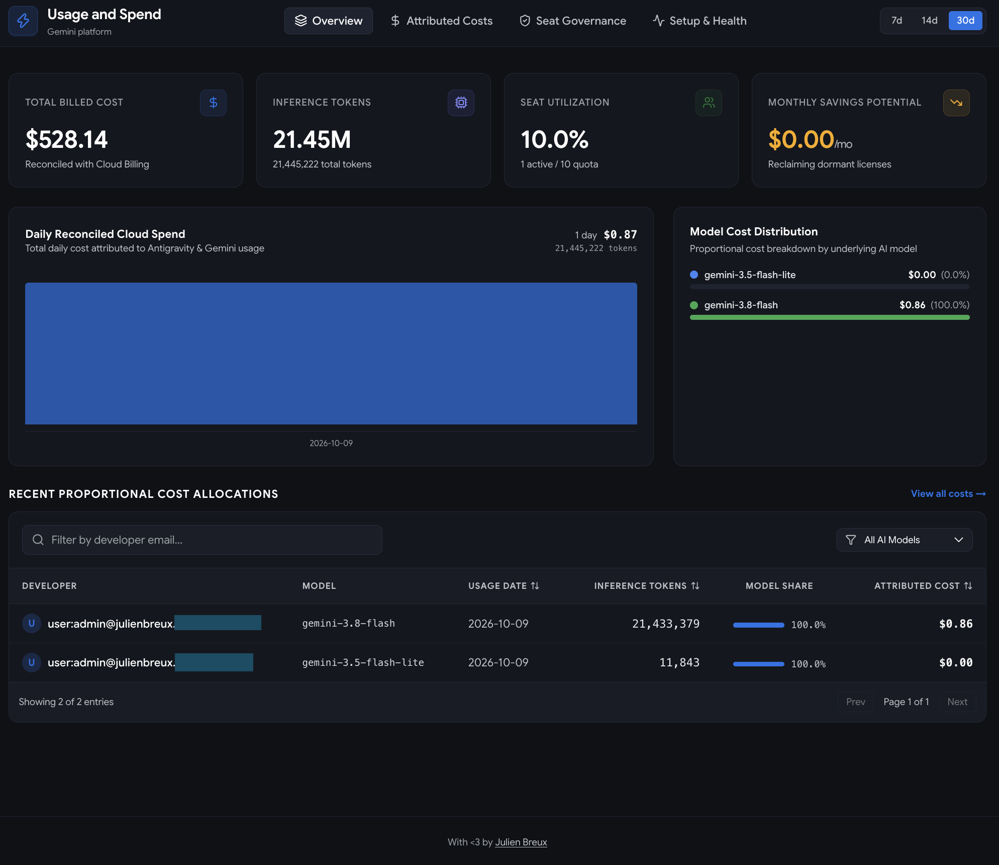
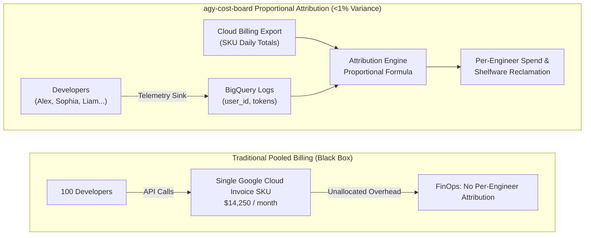

# agy-cost-board

[](https://go.dev/)
[](LICENSE)
[](https://github.com/JulienBreux/agy-cost-board/actions/workflows/ci.yml)
[](https://github.com/JulienBreux/agy-cost-board/actions/workflows/release.yml)
[](https://cloud.google.com/run)
[](https://deploy.cloud.run)

**agy-cost-board** is an enterprise-grade AI FinOps engine and developer telemetry board built for **Google Antigravity** and **Gemini Enterprise**.

It pro-rates Google Cloud Billing export charges strictly proportional to each developer's token share by date and model, eliminates Gemini Enterprise shelfware licenses, and provides immediate cost transparency through a unified single binary (CLI, interactive TUI, and embedded React dashboard).

Based on the Google Cloud architecture article [**"Per-user cost attribution for Antigravity with BigQuery"**](https://medium.com/google-cloud/per-user-cost-attribution-for-antigravity-with-bigquery-3e98fd997c58).

<p align="center">
  
</p>

---

## Why agy-cost-board?

When enterprises adopt AI developer tools like Antigravity and Gemini Enterprise, standard Google Cloud invoices pool all model API consumption into aggregate SKU lines. Platform and FinOps teams are left with zero visibility into which engineering squads, repositories, or individual developers drive generative AI costs.

Furthermore, Gemini Enterprise seats are often purchased in bulk quotas ($45/seat/month). Without automated activity tracking, organizations waste thousands of dollars each month on unassigned or dormant licenses.

`agy-cost-board` bridges this gap: it correlates BigQuery inference logs with Cloud Billing exports to allocate exact proportional costs down to the cent, while continuously auditing seat activity to reclaim idle licenses.



### The Difference at a Glance

| Capability                      | Traditional Cloud Billing                                  | agy-cost-board                                                                               |
| ------------------------------- | ---------------------------------------------------------- | -------------------------------------------------------------------------------------------- |
| **Cost Attribution**            | Aggregate pooled SKU line items; zero developer visibility | **Exact per-developer proportional attribution pro-rated by token share**                    |
| **Gemini Enterprise Shelfware** | Blind seat purchases; shelfware goes unnoticed             | **Automated dormancy detection (<1k tokens / 0 activity) with instant ROI savings**          |
| **Setup & Diagnostics**         | Manual SQL writing & error-prone IAM debugging             | **5-Point automated verification engine with 1-click cloud provisioning (`setup --create`)** |
| **User Interfaces**             | Spreadsheet exports or fragmented monitoring tools         | **Triple-interface in 1 binary: Full CLI, interactive Terminal UI (TUI), & React 19 SPA**    |
| **Cloud Run Native**            | Complex multi-container deployments                        | **Zero-config single static binary (`CGO_ENABLED=0`), dynamic `$PORT`, & `/healthz`**        |
| **Local Evaluation**            | Requires full GCP credentials and BigQuery permissions     | **Offline synthetic Demo Mode (`--demo`) with 30 days of multi-user data**                   |
| **BigQuery Efficiency**         | Costly repetitive full-table scans                         | **Thread-safe in-memory TTL caching with 0 redundant scan charges**                          |

---

## Superpowers

### 📐 Mathematical Proportional Attribution
Instead of crude token-rate approximations, `agy-cost-board` reconciles real-time Cloud Logging inference records (`InferenceResponseLog`) with actual Google Cloud Billing exports (`gcp_billing_export_v1_*`). Each developer is charged precisely:
$$\text{Allocated Cost}(u, m, d) = \text{Billed Cost}(m, d) \times \frac{\text{Tokens}(u, m, d)}{\sum_{k} \text{Tokens}(k, m, d)}$$
Guaranteed mathematically complete attribution with zero unallocated residue.

### 💺 Gemini Enterprise Shelfware Reclamation
Track active seat quota utilization across configurable lookback windows (7d, 14d, 30d). `agy-cost-board` flags **Active**, **At-Risk** (< 1,000 tokens), and **Dormant** (0 tokens) seats, quantifying immediate monthly dollar savings ($45/seat/month) to rightsize your licensing agreements.

### 🩺 5-Point Automated Setup & Diagnostic Engine
Never wonder why metrics aren't appearing. The built-in `setup` and `doctor` commands validate:
1. **Google Cloud ADC & Project:** Active credentials and project binding.
2. **GCP IAM Permissions:** BigQuery Job User (`roles/bigquery.jobUser`) and Data Viewer.
3. **Cloud Logging Sink:** Ingestion sink filter for `InferenceResponseLog`.
4. **Cloud Billing Export:** Validated BigQuery export table schema.
5. **Telemetry Pipeline Probe:** Live token query verification.

Need to provision missing resources? Run `agy-cost-board setup --create` (or preview with `--dry-run`).

### 📦 Standalone Single Binary with Embedded React 19 SPA
Written in Go with zero CGO dependencies. The frontend (React 19, Tailwind CSS, SVG spend charts, and interactive modals) is compiled and embedded directly into the executable using `embed.FS`. No external web servers, Node runtimes, or CDN dependencies required.

### ⚡ Triple-Mode Interface: CLI, Interactive TUI, and Web
- **CLI Commands:** Terminal-ready formatted tables, clean JSON for automation, or CSV for FinOps reporting (`cost`, `license`, `user`, `doctor`).
- **Interactive TUI:** Keyboard-driven terminal dashboard powered by Bubbletea and Lipgloss (`agy-cost-board tui`).
- **Modern Web Dashboard:** Full-featured web interface with dark mode, interactive cost charts, seat governance tables, and real-time setup diagnostics (`agy-cost-board serve`).

### 🧪 100% Offline Synthetic Demo Lab
Evaluate and test all features instantly with `--demo`. Built-in deterministic simulation generates 30 days of realistic multi-user and multi-model data without touching Google Cloud or requiring network access.

> [!NOTE]
> Model names featured in the demo data and illustrations (e.g., `gemini-4.0-pro`, `gemini-4.0-flash`) are purely imaginary and used solely for simulation and demonstration purposes.


---

## Quick Start (60 Seconds)

### 1. Build or Download
Compile the standalone static binary (requires Go 1.27+ and Node 22+):
```bash
git clone https://github.com/JulienBreux/agy-cost-board.git
cd agy-cost-board
make build
```

### 2. Run in Demo Mode (No GCP Required)
Explore all interfaces immediately with synthetic data *(model names like `gemini-4.0-pro` are purely imaginary)*:


```bash
# Print proportional cost attribution table
./bin/agy-cost-board cost --demo

# Inspect Gemini Enterprise license utilization & shelfware savings
./bin/agy-cost-board license --demo

# Launch the interactive terminal UI (TUI)
./bin/agy-cost-board tui --demo

# Launch the web dashboard and open http://localhost:8080
./bin/agy-cost-board serve --demo
```

---

## Connecting to Google Cloud & BigQuery

### 1. Run Automated Environment Verification
```bash
# Diagnose existing setup
./bin/agy-cost-board setup --project=YOUR_PROJECT_ID

# Automatically provision missing BigQuery dataset and Logging sink
./bin/agy-cost-board setup --project=YOUR_PROJECT_ID --create

# Save verified configuration to .agy-cost-board.yaml
./bin/agy-cost-board setup --project=YOUR_PROJECT_ID --save
```

### 2. Launch with Production BigQuery
Once configured in `.agy-cost-board.yaml` (or via environment variables):
```bash
./bin/agy-cost-board serve --port 8080
```

---

## CLI Command Reference

| Command        | Description                                                       | Example                                        |
| -------------- | ----------------------------------------------------------------- | ---------------------------------------------- |
| `setup`        | Diagnose GCP requirements and optionally provision datasets/sinks | `agy-cost-board setup --project=my-prj --save` |
| `cost`         | Display proportional per-developer AI spend attribution           | `agy-cost-board cost --days=30 --format=json`  |
| `license`      | Analyze Gemini Enterprise seat utilization and dormant licenses   | `agy-cost-board license --days=30`             |
| `user <email>` | Drill down into an individual developer's token history and spend | `agy-cost-board user alex@google.com`          |
| `doctor`       | Fast connectivity and configuration sanity check                  | `agy-cost-board doctor`                        |
| `tui`          | Launch interactive full-screen terminal dashboard                 | `agy-cost-board tui`                           |
| `serve`        | Start web dashboard HTTP server with embedded React SPA           | `agy-cost-board serve --port=8080`             |

---

## REST API Reference

The built-in HTTP server exposes clean JSON APIs consumed by the embedded frontend and third-party monitoring:

| Method | Endpoint                             | Description                                                      |
| ------ | ------------------------------------ | ---------------------------------------------------------------- |
| `GET`  | `/healthz`                           | Liveness and readiness probe for Cloud Run / Kubernetes          |
| `GET`  | `/api/v1/metrics/overview?days=30`   | High-level FinOps KPIs, total spend, tokens, and daily trends    |
| `GET`  | `/api/v1/costs/users?days=30&model=` | Attributed cost records per developer and model                  |
| `GET`  | `/api/v1/licenses/status?days=30`    | Seat quota, active/dormant status, and estimated monthly savings |
| `GET`  | `/api/v1/users/{id}?days=30`         | Developer drilldown, historical spend, and model breakdown       |
| `GET`  | `/api/v1/setup/status`               | Real-time 5-point GCP telemetry diagnostic status                |
| `GET`  | `/statusline.sh?user=&days=30&ttl=300` | Dynamic Antigravity CLI statusline script with user spend display |

---

## Antigravity CLI Statusline Spend Integration

Display individual developer AI spend directly in the Antigravity CLI status bar (e.g., ` · cost $123`) using a dynamic, fail-open fork of the official Antigravity statusline script.

### One-Line Quick Install

Download and configure the script directly from your deployed `agy-cost-board` instance:

```bash
curl -sS https://<YOUR_AGY_COST_BOARD_URL>/statusline.sh -o ~/.config/antigravity/statusline.sh && chmod +x ~/.config/antigravity/statusline.sh
```

### Antigravity Configuration

To activate the statusline script in Antigravity, add or update the `statusline` setting in `~/.config/antigravity/config.json`:

```json
{
  "statusline": "~/.config/antigravity/statusline.sh"
}
```

Or configure the environment variable in your shell profile (`~/.zshrc` or `~/.bashrc`):

```bash
export AGY_STATUSLINE="$HOME/.config/antigravity/statusline.sh"
```

### Download Customization (Query Parameters)

When downloading the script via `curl`, you can customize default settings:

| Parameter | Default | Description |
| --------- | ------- | ----------- |
| `user`    | *(auto)* | Pre-bake your email address into the script (e.g., `?user=alex@google.com`) |
| `days`    | `30`    | Lookback window in days for spend aggregation (e.g., `?days=14`) |
| `ttl`     | `300`   | Local spend cache time-to-live in seconds (e.g., `?ttl=600` for 10 minutes) |

Example:
```bash
curl -sS "https://<YOUR_AGY_COST_BOARD_URL>/statusline.sh?user=alex@google.com&days=30&ttl=300" -o ~/.config/antigravity/statusline.sh && chmod +x ~/.config/antigravity/statusline.sh
```

### User Resolution Hierarchy

When executing, the script resolves the developer's user identity in the following order:
1. `AGY_COST_USER` environment variable
2. Pre-baked `user` query parameter
3. Active Google Cloud account (`gcloud config get-value account`)
4. Git author email (`git config user.email`)
5. Local machine username (`$USER`)

### Environment Variable Overrides

Developers can override runtime behavior without redownloading the script:

| Environment Variable | Default | Description |
| -------------------- | ------- | ----------- |
| `AGY_COST_USER`      | *(detected)* | Force a specific developer email or identity |
| `AGY_COST_SERVER`    | *(baked URL)*| Override the `agy-cost-board` server base URL |
| `AGY_COST_DAYS`      | `30`         | Number of days for spend calculation |
| `AGY_COST_CACHE_TTL` | `300`        | Local cache TTL in seconds |
| `AGY_COST_DISABLED`  | `false`      | Set to `true` or `1` to disable the cost suffix |

### Cloud Run IAM & Security

If your `agy-cost-board` instance is deployed to Cloud Run with authentication required (`--no-allow-unauthenticated`), the script automatically fetches an identity token via `gcloud auth print-identity-token` and transmits it in an `Authorization: Bearer <token>` header.

### Performance & Fail-Open Guarantee

- **Zero Terminal Latency:** Spend is read from `/tmp/agy_cost_<hash>.cache`.
- **Asynchronous Background Refresh:** When the cache expires, the script immediately renders the existing spend and spawns an asynchronous background subshell to refresh the cache.
- **Stampede Protection:** Lock files prevent multiple concurrent subshell calls from flooding your server.
- **Fail-Open Resilience:** If network connectivity is lost, Cloud Run returns 403/500, or `curl` times out (1s timeout), the script gracefully degrades and outputs the standard statusline without the cost suffix, never blocking or crashing the CLI.

---

## Deploy to Cloud Run in One Click

Deploy `agy-cost-board` directly to your Google Cloud project with one click using the Cloud Run Button:

[](https://deploy.cloud.run)

### Prerequisites
Before deploying, ensure you have:
1. A Google Cloud project with billing enabled.
2. The Cloud Run API (`run.googleapis.com`) and Cloud Build API (`cloudbuild.googleapis.com`) enabled.
3. BigQuery Data Viewer (`roles/bigquery.dataViewer`) and Job User (`roles/bigquery.jobUser`) permissions on your telemetry and billing export datasets.

### Configuration Parameters
When clicking the deployment button, Cloud Run prompts for parameters defined in `app.json`:
- **`PROJECT_ID`**: Google Cloud Project ID hosting your BigQuery telemetry and billing tables.
- **`AGY_COST_BOARD_DEMO`**: Set to `"true"` to explore immediately with simulated demonstration data, or `"false"` (default) to query production BigQuery tables.
- **`AGY_COST_BOARD_TELEMETRY_TABLE`**: Full BigQuery table path for inference telemetry logs (e.g., `project.dataset.table`).
- **`AGY_COST_BOARD_BILLING_TABLE`**: Full BigQuery table path for the Google Cloud Billing export.

### Accessing Your Deployed Service
The service is deployed with **IAM authentication required** (`allow-unauthenticated: false`) to safeguard enterprise cost and telemetry data:
- **Direct Authorized Proxy:** Use the Google Cloud CLI to access the dashboard locally:
  ```bash
  gcloud run services proxy agy-cost-board --project=YOUR_PROJECT_ID
  ```
- **Browser Access with IAM / IAP:** Grant individual users or groups the **Cloud Run Invoker** (`roles/run.invoker`) role in Cloud IAM or place the service behind Google Cloud Identity-Aware Proxy (IAP).

### Declarative Deployment via `deploy.yaml`

Inspired by the Cloud Run Button configuration (`app.json`), `deploy.yaml` provides a Knative-compatible declarative Service manifest (`serving.knative.dev/v1`) for GitOps, IaC, and continuous delivery:

```bash
# 1. Substitute your GCP project ID and deploy declaratively
sed 's/PROJECT_ID/'"$(gcloud config get-value project)"'/g' deploy.yaml | \
  gcloud run services replace - --region=us-central1

# 2. Or apply deploy.yaml directly once configured
gcloud run services replace deploy.yaml --region=us-central1
```

---

### Manual Deployment via gcloud

You can also build and deploy manually using the Google Cloud CLI:

```bash
export PROJECT_ID="YOUR_GCP_PROJECT_ID"
export IMAGE="gcr.io/${PROJECT_ID}/agy-cost-board:latest"

# 1. Build and push container using Google Cloud Build
gcloud builds submit --tag ${IMAGE} .

# 2. Deploy to Cloud Run
gcloud run deploy agy-cost-board \
  --image=${IMAGE} \
  --project=${PROJECT_ID} \
  --region=us-central1 \
  --platform=managed \
  --no-allow-unauthenticated \
  --set-env-vars="GCP_PROJECT=${PROJECT_ID},TELEMETRY_TABLE=${PROJECT_ID}.antigravity_telemetry.logs,BILLING_TABLE=${PROJECT_ID}.billing_export.gcp_billing_export_v1_XXXXXX,SEAT_QUOTA=50"
```

---

## Development & Testing

```bash
# Run unit tests with race detection and coverage
make test

# View test coverage report
make cover

# Run static analysis
make lint

# Rebuild web frontend assets
make build-web

# Build static binary with version ldflags
make build
```

---

## Community & Contributing

We welcome contributions from everyone! Please check out our project guidelines:

- 🤝 [**Contributing Guide**](CONTRIBUTING.md) - How to report issues, develop locally, and submit pull requests.
- 📜 [**Code of Conduct**](CODE_OF_CONDUCT.md) - Our standards for community engagement.
- 🔒 [**Security Policy**](SECURITY.md) - Vulnerability reporting and least-privilege GCP security.
- 👥 [**Maintainers**](MAINTAINERS.md) - Project maintainers and governance.

---

## License

This project is licensed under the [Apache 2.0 License](LICENSE).
